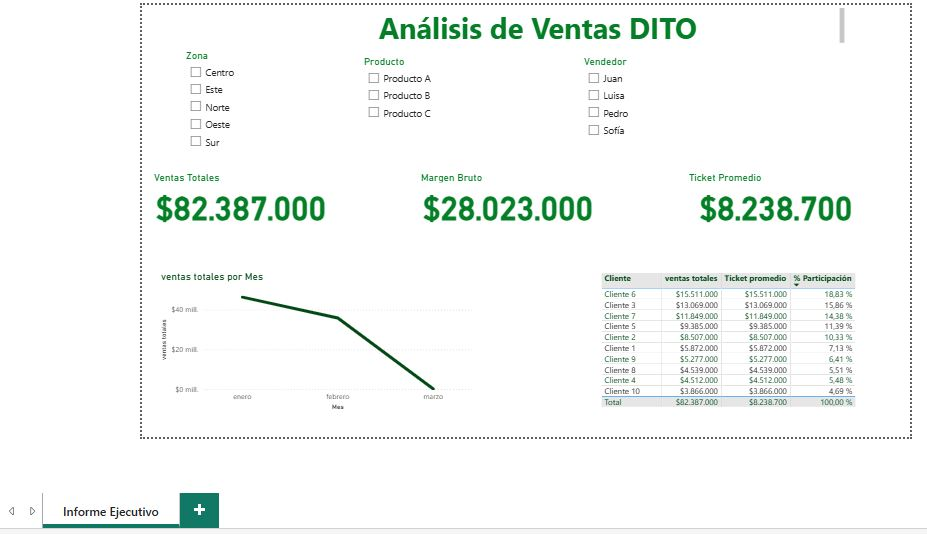

# 📊 Análisis de Ventas DITO

Proyecto desarrollado como respuesta a un assessment técnico de la empresa **DITO**.  
El objetivo fue analizar ventas mediante limpieza de datos en Excel y desarrollo de un dashboard profesional en Power BI.

---

## ⚙️ Flujo Automatizado

El flujo fue **automatizado con Python**, asegurando limpieza robusta de fechas, cálculo de métricas clave, y generación de archivo limpio para Power BI.

```python
# Limpieza, transformación y exportación de datos con pandas y openpyxl

📂 DITO/
├── limpieza_dito.py                # Script de limpieza con pandas y openpyxl
├── ventas_limpias.xlsx            # Archivo limpio exportado
├── analisis-de-ventas-DITO.pbix   # Dashboard Power BI
├── assessment powerbi excel.xlsx  # Archivo original recibido
├── paquetes.txt                   # Librerías usadas
└── README.md                      # Documentación del proyecto
```
## 🖼 Vista previa del dashboard

